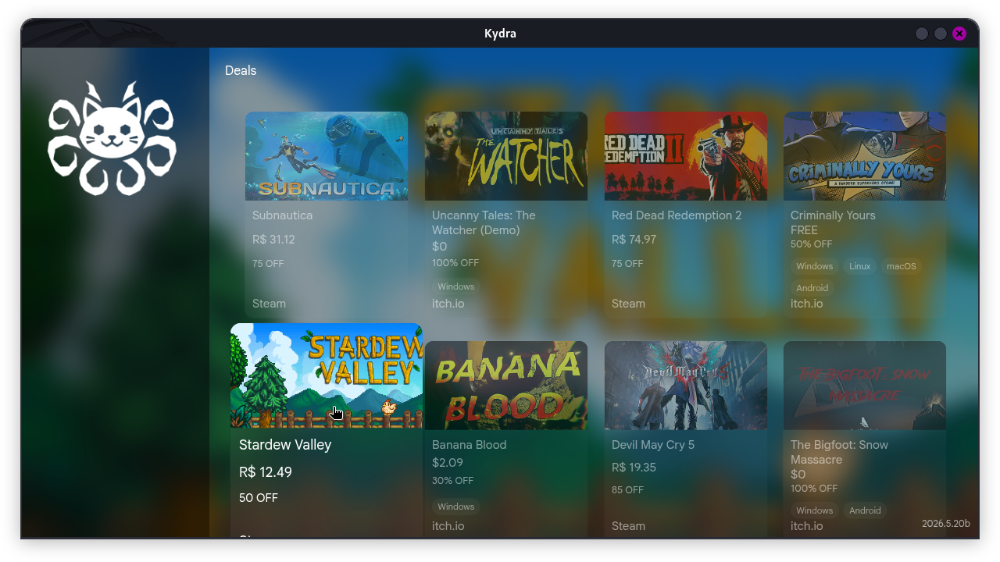

# Kydra
### A modern indie game hub focused on Itch.io, Steam, and third-party games.

---
## Features
- Itch.io integration via local API
- Steam game integration via public API
- Add and manage local (third-party) games
- Launch games directly from the launcher
- Game details (header, logo, screenshots)
- Deals / discounted games section
---
## Build from source
- Documentation [here](./docs/BUILDING.MD)
---
## Contributors

---
## License
- Kydra is licensed under the [MIT License](LICENSE).
---

  
© 2026 K7 Sistemas

