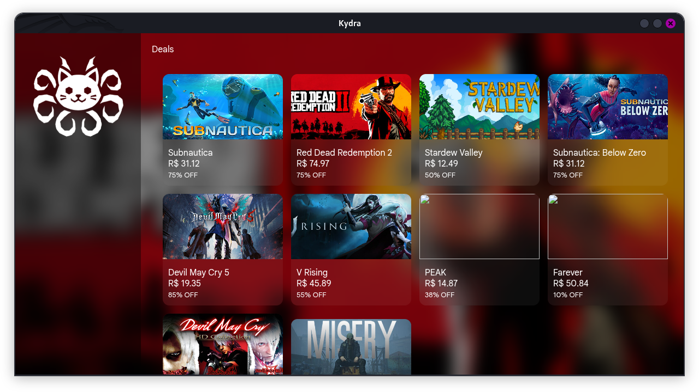

# Kydra
### A hybrid game launcher for managing games from Steam, Itch.io, and third-party games.

---
## About
- Kydra is a lightweight and modern game launcher that unifies Steam games and manually installed games into a single library.
---
## Features
- Steam game integration via public API
- Add and manage local (third-party) games
- Launch games directly from the launcher
- Game details (header, logo, screenshots)
- Deals / discounted games section
---
## Build from source
- Documentation [here](./docs/BUILDING.MD)
---
## License
- Kydra is licensed under the [MIT License](LICENSE).
---

  
© 2026 K7 Sistemas

